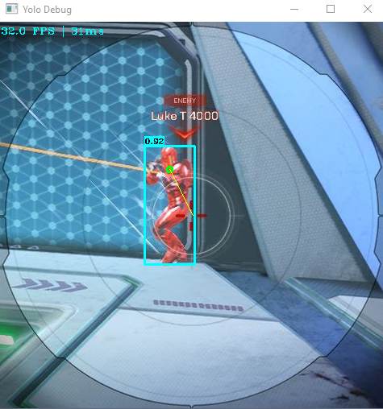

# Object Detection - Splitgate

<!-- PROJECT LOGO -->
<p align="center">
  <a href="">
    
  </a>
  <h3 align="center">Object Detection for FPS games</h3>
  <p align="center">
  <a href="https://github.com/matias-kovero/ObjectDetection/issues">Report Bug</a>
  </p>
</p>

<!-- TABLE OF CONTENTS -->
<details open="open">
  <summary>Table of Contents</summary>
  <ol>
    <li>
      <a href="#about-the-project">About the Project</a>
      <ul>
        <li><a href="#disclaimer">Disclaimer</a></li>
        <li><a href="#built-with">Built With</a></li>
      </ul>
    </li>
    <li>
      <a href="#getting-started">Getting Started</a>
      <ul>
        <li><a href="#prerequisites">Prerequisites</a></li>
        <li><a href="#installation">Installation</a></li>
      </ul>
    </li>
    <li><a href="#usage">Usage</a></li>
    <li><a href="#final-words">Final words</a></li>
  </ol>
</details>

<!-- ABOUT THE PROJECT -->
## About The Project
[<p align="center"></p>](./docs/debug.png)

This project started as an experiment as  
> _is it possible to "cheat" in FPS games using object detection_.

I already know that object detection gives valuable information from images and is used in many sectors - from social media algorithms to basic factory quality control. I'v had an opporturnity to work with image recignition and on my spare time I have also created my own scrapers that classify images - for vaurious different cases. But that all is made on still images from different sources - where there isn't really any hurry on the inference results. 

I wanted to find out would it be feasible to inference a FPS game, and then use the inference results to our advantage. The biggest issue was: _will this be practical_ - as will it be fast enough. The inference would need to run on the same machine as the game and would it be hindered by the GPU.

As traditional video game hacking is made by reading process memory and different anti-cheats try to detect & block these reads. Object detection would take an totally different approach - no memory reading - thus would have the possibility to be undetected by anti-cheat. Second issue would be that how could we send input to the desired video game without triggering any flags. Main goal of this project is to showcase an POC, that indeed this is currently possible with relative affordable equipment.

### Disclaimer
I do not condem any hacking - it ruins the fun for you but also for other players. This project was created just to show that it is possible to "cheat" using object detection. Also this is my first bigger python project and totally first time using multiprocessing and threads. There might be some optimisations but I managed to inferece with my 1660 super @ 30 FPS while the game was running.

### Built With
I won't go to details on how to create your own custom models - if you want to learn how to create your own models - head to [Github YOLOv5](https://github.com/ultralytics/yolov5)

Here is an list of programs / platforms I used for this project:
- [YOLOv5](https://github.com/ultralytics/yolov5) Object detection (custom model)
- [Google Colab](https://colab.research.google.com/) to train my model - they give free GPU (ex. my 300 epoch took only 4h)
- [CVAT](https://cvat.org/) to label my datasets
- [Roboflow](https://app.roboflow.com/) to enrich these datasets
- [Interception_py](https://github.com/cobrce/interception_py) for mouse hooking (more on why this later)

<!-- Getting started -->
## Getting started
This repo contains my two pretrained modes that will detect enemies in Splitgate.  
`best.pt` is trained on +600 images for 300 epoch.  
`bestv2.pt` is then refined from that with +1500 images and an another 300 epochs.  

If you want to test this out in different games, you will need to create your own models.

### Prerequisites
- Install [Interception Driver](https://github.com/oblitum/Interception)
- [Python 3.x](https://www.python.org/downloads/)
- [YOLOv5 requirements](https://github.com/ultralytics/yolov5#quick-start-examples) ex. PyTorch - I selected CUDA 10.2 version

Interception driver is selected because it will hook to your mouse on OS level - has low latency and does not trigger virtual_mouse flag - anticheat softwares may look for that flag.  
If you aren't okay on installing that driver you will need to alter `inter.py` and use ex. [pyautogui](https://pyautogui.readthedocs.io/en/latest/) or [mouse](https://github.com/boppreh/mouse) - however latency might become an issue.

### Installation
When above steps are done you only need to clone the repo:
```sh
git clone https://github.com/matias-kovero/ObjectDetection.git
```

## Usage
If you are looking for an out of the box working solution - this is not your repo. I have stripped the smooth aim - as I see it would create harm to Splitgates community. Currently the code has an really simple aim movement - that more likely will get you flagged - but still proves my point that you can _"hack"_ with this.  

### `main.py`
Main entrypoint - params found [here](link_to_params). Example usage:
```sh
python .\main.py --source 480 --debug true
```
You can change `--source` and `--img` for better performance (smaller img = faster inference, but accuracy suffers).  
If you have an beefy GPU and want better accuracy, try to set --img to 640 and what ever source.
### `gather.py`
When you want to create your own datasets, run this to collect images.
Check source for additional info, but defaulted to take screenshots when user shoots - and cooldown of 10 seconds.
```sh
python .\gather.py
```

## Final words
I was suprised how "easily" you could inference and play the game with relative low budget GPU.
My 1660 Super managed to inference with about 25ms delay (~30FPS) and hooking it up with smoothing aim created an discusting aimbot.  
I really don't know how anti-cheats could detect this kind of cheating - without scanning agressively processes you are running - but then would an python process still flag anything?
